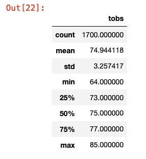
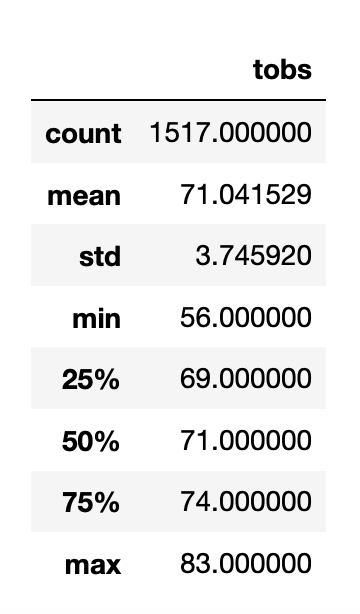

# surfs_up

## Overview of the school district analysis
The purpose of this analysis is to help myself to open a Surf n' Shake shop serving
surfboards and ice cream to locals, tourists, and myself. And I will need real
investor backing to get this off the ground. And I will need to consider the
weather analysis where I will open the shop in the Oahu.

## Results

- From the two dataframes we get from June and December, we can see the first
  - difference is that the minimum temperature in June is 64 and the minimum
  - temperature in December in December is 56, so December is probably colder
  - which may cause less consumers to visit the shop/
- Average temperature in June is also greater than December
- The standard deviation of temperature in June is smaller means smaller variation.

## Summary
